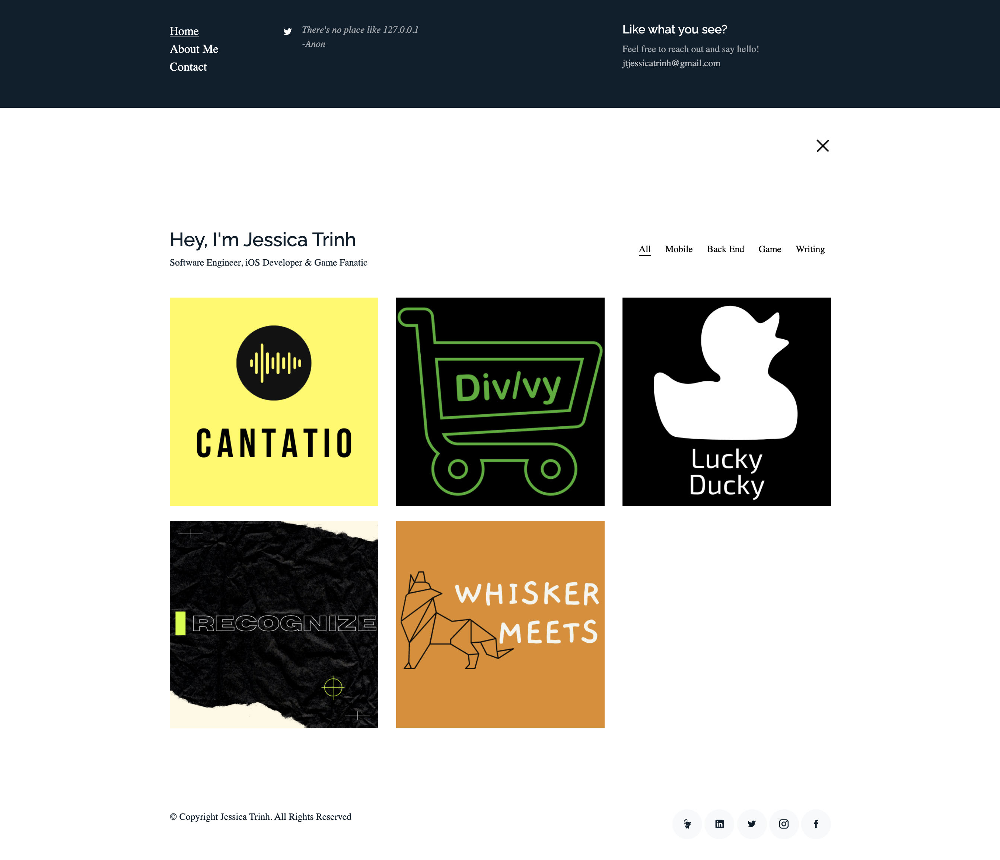

# Personal Portfolio Site    

## Introduction
Welcome! This is the Github repository of my personal technical portfolio that is intended to show others projects I have been working on throughout my techncial journey in software engineering and product development. You can see the live site [here](https://ellojess.codes/) or type **ellojess.codes** in your browser.

## Requirements

## Development Proccess 

## Future Lookouts
- [ ] DRY
- [ ] vLogs
