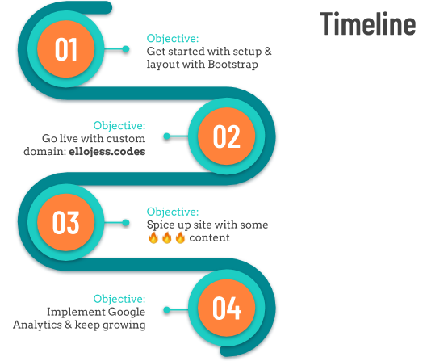

# Personal Portfolio Site  [](https://standardjs.com)  


## Introduction
Welcome! This is the Github repository of my personal technical portfolio that is intended to show others projects I have been working on throughout my techncial journey in software engineering and product development. You can see the live site [here](https://ellojess.codes/) or type **ellojess.codes** in your browser.

## Development Process
 

The portfolio site was made primarily with Bootstrap and is responsive and adaptive to both mobile and web platforms. It contains HTML, CSS, and JavaScript-based design templates for typography, forms, buttons, navigation, and other interface components.

## The Code
**Note:** If you have any issues or contributions you would like to bring up, feel free to submit it **[here](https://github.com/ellojess/portfolio/issues/new)**

If you'd like to view the code locally on your desktop, follow these steps: 

1. Download or clone this repo 
  ```bash
  $ git clone git@github.com:ellojess/portfolio.git
  ```
  
2. `cd` into the project folder and open it in your chosen text editor (or use `code .` to open it in Visual Studio Code

  ```bash
  $ cd portfolio
  $ code . 
  ```

## Future Lookouts
- [ ] DRY
- [ ] vLogs
- [ ] Active contact form 

## Additional Links 
[Pitch Deck](https://drive.google.com/file/d/1QcKhIyZQiJYvD0Sx-K9tHY0pse0as99q/view?usp=sharing)
